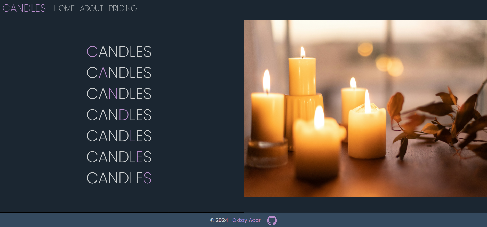

# World of Candles

## Description

This repository contains **World of Candles**, a beautifully designed, simple one-page website that showcases the enchanting world of candles. This project features a responsive layout built with Bootstrap and custom CSS, ensuring an elegant user experience across all devices.

- **Bootstrap Version:** [5.3.3](https://getbootstrap.com/docs/5.3/getting-started/introduction/)

## Screenshot

The screenshots show only a portion of the web page.
| **Screenshot 1** |
| :--------------------------------------------------------------------------------------: |
|  |

|                   **Screenshot 2**                   |
| :--------------------------------------------------: |
|  |

## Sources

- **Icons**
  - [GitHub Icon](https://icons.getbootstrap.com/icons/github/)
  - [Candle Icon](https://www.flaticon.com/free-icons/candle)
- **Images**
  - [Candles 1](https://unsplash.com/photos/white-pillar-candles-on-brown-wooden-table-bdVmIkx_gIs)
  - [Candles 2](https://unsplash.com/photos/low-angle-photo-of-lightened-candles-fvl4b1gjpbk)
  - [Candles 3](https://unsplash.com/photos/white-candles-on-black-surface-iSyyY1GfYSw)
  - [Candles 4](https://unsplash.com/photos/white-candles-on-brown-wooden-table-9xEOFi3uGpM)

---

## License

This repository is licensed under the [MIT License](https://github.com/oktay-acar/world-of-candles/blob/main/LICENSE).

## Author

[Oktay Acar](https://github.com/oktay-acar)
